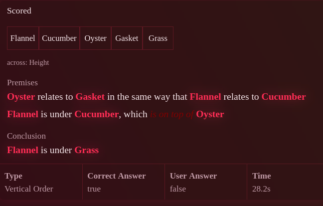
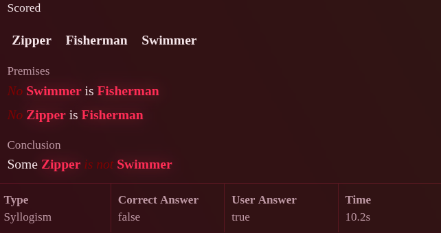

# 1 — Correctness

Three defects where the app is not merely awkward but wrong: an unanswerable
item, a degenerate one, and a node drawn in a colour that does not exist.

They are first because they are cheap and because each has a test that would
have caught it, which is the part worth keeping.

---

## 1.0 Graph Matching stated the impossible, and marked it right — **FIXED**

Reported:

```
Containment:  Fondue is within Cushion · Cushion is within Garland
              Garland is the same size as Lamb · Fondue contains Lamb
Height:       Violin is on top of Paste · Hippopotamus is at the same height as Paste
              Milk is under Hippopotamus · Violin is under Milk
Conclusion:   The two sets describe the same structure   → marked correct
```

Fondue is smaller than Lamb by the chain and larger than Lamb by the last
statement. The height set is impossible in the same shape. **Neither set
describes an arrangement at all**, so "the two describe the same structure" is
true of the arrows and meaningless of the words — and it was marked right.

**The cause is one form, not the mode.** `drawGraph` picks each link
independently from →, ← and ↔, which is correct for the forms that word a link
as *"goes to"* or *"comes from"*: there a cycle is an ordinary graph and nothing
is wrong with it. The `as-relations` rung words the same links as
**comparisons**, and there a cycle is a contradiction — nothing is larger than
the thing it is inside. Nothing constrained the graph when it was dressed that
way.

`orderConsistent` is the constraint: sameness statements merge things into
groups, no group is said to outrank itself, and the groups can be laid out in
some order without a loop. Required of both sets in that form, and of the
perturbed set too, since changing one link can turn a readable set into an
impossible one. Items still build 300 times in 300, and the form still comes up
in a bit over half of them.

**The setup line did not cover this.** *"Compare the statements as made, not
what they add up to"* is a fair instruction about a chain implying more than it
states — A below B below C does not *state* A below C, and that implication is
not part of the pattern. It is not an instruction that can rescue a set which
cannot be true, and asking a reader to hold one is asking them to stop reading
the words.

---

## 1.0b Graph Matching gave itself away by the arrow count — **FIXED**

Reported: *"there should never be a different connects-to count, that is easy to
spot"*. Right, and it was true of every form.

The mode asks whether two edge lists are the same **shape**. A shape question
settled by **counting** is not one: if the odd group has four arrows where the
others have five, or one node with three where every twin has two, it is found
without comparing anything to anything. Counting is the shortcut every reader
finds first.

Every way the generator made two drawings differ handed it over. `perturb`
changed one relation — turn a `→` into a `↔` and that group has a link more. The
base form was worse: it swapped one-way links for two-way ones *and* reconnected
edges to different objects, either of which moves a node's count.

Two moves replace them, and neither changes a number:

- **Trade two relations.** The multiset of link types is untouched by
  construction.
- **Rewire two links end for end.** Given `a → b` and `c → d`, make them
  `a → d` and `c → b` — the classic degree-preserving swap. Every node keeps
  exactly the links it had, and what changed is where they go.

Both are checked rather than trusted: a trade keeps the *totals* but can still
hand one node an arrow more, so `sameDegrees` filters the result, and a draw
that cannot be made to differ without giving itself away is abandoned rather
than served.

**Both moves are needed, not one.** Without the rewire, the two drawings would
always join the same pairs and differ only in which way the arrows point — so
*"same shape?"* would quietly have become *"same directions?"*.

**A note on measuring it.** The first probe parsed the rendered sentences and
reported 33 of 38 items as still broken. They were not: a **meta** premise
states a relation between relations rather than a link, so the parser silently
dropped it and reported its own gap as a counting shortcut. The test reads
`graphPremises` and `graphConclusion` — the edge lists the item was actually
built from — and the group forms are read through the shared `readGroups`.

---

## 1.0c Analogy marked a correct answer wrong — **FIXED**

> Occasionally a correct answer gives me feedback that it was wrong, in
> multiple conclusions especially transformation I believe.

It was Analogy, and it was conditional rather than occasional.

Analogy has no relation of its own. It takes a finished item from one of five
other modes, keeps its premises, and **reuses the object** — overwriting the
conclusion with a claim of its own form: *A is to B as C is to D, alike or
unlike*. Everything the inner mode had set about how *it* was answered came
along with the premises.

When the inner item carried the `construct-conclusion` rung, `answerMode` was
still `"construct"`. So the card showed the construction builder — several
claims to fill in, which is the "multiple conclusions" in the report — for a
question the item no longer asked, and `checkConstruction` passed
"did you build that arrangement" into a scoring line that compared it against
whether the analogy held. **A right answer was scored wrong and a wrong one
right.** The same applies to an inherited `"choice"` mode, where the options
belong to the inner item and the truth to the analogy.

### It had been half-fixed already, which is the interesting part

The series version of exactly this was reported earlier and fixed: an inherited
series stepped the player through claims about a question the card no longer
asked. That fix cleared `series`, `seriesAt` and `seriesAnswers` — the three
fields the symptom named — and left the rest of the same apparatus behind.

So this time the clearing is a method on `Question`, `askAsTrueOrFalse()`,
sitting next to the fields it clears, and Analogy's takeover is one call to it.
Analogy's own ladder is `["negation", "meta"]`: it has no construction or
picking rung and was never meant to serve one.

### Three tests, at three altitudes

`tsc` cannot see any of this — every field is on every `Question`, and a stale
one is a value, not a type error. `tests/answering.test.ts`:

1. **The apparatus matches the answer mode**, for every mode, both with rungs
   and without: a boolean item carries no options and nothing to build, a
   picking item has options and a correct one among them, and — the line that
   fails on this bug — anything not answered as a judgement has `isValid` true,
   or a correct answer is scored wrong by construction.
2. **Every claim of a series is answerable the way the item is**, since
   advancing swaps a claim's text, truth, options, prompt and premises and
   nothing else. The two modes whose apparatus the advance cannot swap —
   construction and matching — may not carry a series at all.
3. **The report itself, walked.** Answer every claim the way the item says is
   right; it has to come out right. That one needed a seam: the rule lived
   inside `checkQuestion`, which also stops clocks, plays sounds and builds the
   next question, so it moved to `utils/answer.utils.ts` as `hasNextClaim`,
   `takeSeriesAnswer` and `judgeItem`. With the fix reverted it fails saying
   *"Analogy: every claim answered right and the item scored wrong"*, which is
   the report in the test runner's words.

The three catch different things and the bug tripped all three, which is the
point of having them at different altitudes: the invariant would pass a mode
that agreed with itself and mis-scored anyway, and the walk would pass a mode
whose fields were quietly wrong in a way the scoring happened not to read.

---

## 1.1 A conclusion naming an object no premise states — **FIXED**

**Found: wide premises and meta relations, together.** Eight items in a hundred
with both on. `createMetaRelationships` consumed a premise and replaced it with
a meta premise naming that premise's two objects — but a *wide* premise states
two relations over three objects ("A is under B, which is under C") and
`extractSubjects` returns the first two, so the third lost its only mention. The
conclusion is chosen before this runs, against the full layout, so it could ask
about the object that had just been deleted. Meta now only consumes premises
stating exactly one relation, which is the only kind it can honestly restate.

**Why the sweep did not find it.** The combination sweep runs all rungs on or
all rungs off; with all on, `constructConclusion` wins and the boolean
conclusion path never executes. The bug lived in the gap between the two
settings, where a two-state sweep has no coverage by construction. That is the
more useful finding of the two and it is not fixed — the sweep still has the
hole; only this one pair of rungs is now pinned by a case of its own.

The original diagnosis follows, including the hypothesis that turned out to be
right about the mechanism and wrong about which code path reached it.

---

### The original diagnosis



Vertical Order, with the analogy and meta modifiers live. The premises are:

> Oyster relates to Gasket in the same way that Flannel relates to Cucumber
> Flannel is under Cucumber, which *is on top of* Oyster

and the conclusion is **Flannel is under Grass**. `Grass` appears in the object
bank at the top of the card and in no premise. The item is not hard; it is
unanswerable, and it was graded `true`.

### Why it is possible at all

There is a guard, and it does not guard this. `isPremiseLikeConclusion` in
[`utils/question.utils.ts:44`](../src/app/syllogimous/utils/question.utils.ts)
compares the conclusion's *subject pair* against each premise's subject pair and
rejects an exact match. It says nothing about whether the conclusion's subjects
appear in the premise set at all, and it is only called from four generators —
[`syllogism.ts:60`](../src/app/syllogimous/generators/syllogism.ts),
[`linear.ts:144`](../src/app/syllogimous/generators/linear.ts),
[`stimulus-function.ts:153`](../src/app/syllogimous/generators/stimulus-function.ts)
and deliberately not from `deictic.ts` (see its comment at line 33).

The object bank is drawn from `getSymbols`, which hands out more stimuli than
the layout uses. A conclusion builder that picks from the bank rather than from
the layout will therefore reach an unused word roughly as often as the bank is
oversized. The suspect is the second-order path: the analogy rung takes a
finished scale item and rewrites the conclusion, and the `wide`/meta rendering
in [`linear.utils.ts:610`](../src/app/syllogimous/utils/linear.utils.ts)
rewrites premises after the fact — so the set of objects the *premises* mention
is no longer the set the *layout* holds, and a conclusion picked from the layout
can name something the rendered premises dropped.

That is a hypothesis with a named place to look, not a diagnosis. Confirm it
before fixing it.

### The fix, in two parts

**The invariant, in the harness.** This is the durable half and it is
mode-independent:

> Every `.subject` span in the rendered conclusion must also appear as a
> `.subject` span in at least one rendered premise, in every mode, at every
> premise count, under every modifier combination.

It reads only rendered HTML, which is the house rule for these checks, and
`extractSubjects` already exists to parse it. Add it to `tests/generators.test.ts`
where the existing all-modes sweep lives, so it runs against the same matrix of
modifier combinations that `tests/combinations.test.ts` builds.

Expect it to fail in more than one mode. That is the point of writing it as an
invariant rather than as a patch: the source lists one instance, and a bank
oversized by two words in twenty modes will not have produced exactly one.

**The generator fix.** Whatever the sweep turns up, the shape of the repair is
the same in each: the conclusion must be drawn from the objects the *premises
name after rendering*, not from the bank and not from the layout. Where a mode
genuinely needs a distractor object in the bank — several do, and it is a real
difficulty knob — the bank stays oversized and only the conclusion picker
narrows.

---

## 1.2 The two-negative-premise syllogism



> No Swimmer is Fisherman. No Zipper is Fisherman. ⊢ Some Zipper is not Swimmer.
> Correct answer: **false**.

**The logic is right and the presentation is what is wrong.** Settled by the
author: *"so it's not a wrong syllogism, the only error is how the display of
the explanation is misleading."* Two negative premises entail nothing, so the
conclusion does not follow, so `false` is correct. `sylEntails` is not at fault
and nothing in this section touches it.

**What misleads is the layout.** A syllogism is served in the same premise list
every other mode uses — one relation per line, subject, relation, object,
stacked. That layout is a chain: it is how the scale modes state *A is above B,
B is above C*, and it is read as one, so the eye walks the premises expecting
each to compose onto the last. A syllogism is not a chain. It is two statements
about class membership joined by a middle term, and *"No Swimmer is Fisherman /
No Zipper is Fisherman"* stacked in that layout invites reading a link from
Swimmer through Fisherman to Zipper that is not there.

**The fix is a Venn diagram**, and it is written up as the headline of
[3.3](3-explanations.md#33-the-syllogism-derivation-reads-as-a-chain) with the
rest of the syllogism display work, since it is the same fix shot 08 asks for.
Overlap, exclusion and the existential dot are the whole content of a syllogism
and a chain of sentences is the one shape that cannot show them.

### Separately, and not what was reported

An observation from reading the generator rather than from the source list, kept
because it is cheap and adjacent — but it is not the reported defect and should
not displace the diagram.

Every item with two negative premises has the same answer, for a reason that
requires no reading of the item: two negatives never entail. A player who
notices that can answer this class of item correctly, forever, without reading
past the second word of each premise. The same is true of two particular
premises. Two things follow.

**Distinguish "ruled out" from "not settled".** The hierarchy work already made
exactly this distinction and recorded why — see the Set Hierarchy entry in
[`roadmap/open.md`](../roadmap/open.md): both look like "false" and they are not
the same thing, so the derivation says which, and the generator draws between
them deliberately rather than letting one dominate. Plain Syllogism never got
that treatment. `sylEntails` in
[`utils/syllogism.utils.ts`](../src/app/syllogimous/utils/syllogism.utils.ts)
refutes rather than derives, so it already has the information; it is the
generator and the derivation that throw it away.

With that in place, the item above becomes *"the premises leave this open"*
rather than *"this is false"*, which is both a truer statement and a different
answer key — and it removes the shortcut, because "two negatives" tells you the
conclusion is not entailed but says nothing about whether it is refuted.

**Then cap the degenerate figures.** Premise pairs that violate the basic
syllogistic rules — two negatives, two particulars, undistributed middle —
should not be drawn at the rate a uniform pick gives them. Not banned: a player
should meet them, and recognising one *is* a skill. Capped, so the answer
distribution stops being predictable from the premise quantifiers alone. The
hierarchy generator already does this by drawing the wanted answer once and
searching for an item that has it, rather than drawing items and taking what
comes; the same inversion applies here.

**Verification.** Over 150 generated syllogisms, no single quantifier pattern
may predict the answer better than chance. That is a stronger and more honest
check than counting the answer distribution, because the distribution was
already balanced when this item was produced.

---

## 1.3 The black node in Relational Web


"The black of the A is also bad." This one is fully diagnosed.

[`relational-web.component.ts:161`](../src/app/syllogimous/components/relational-web/relational-web.component.ts):

```ts
markColor(slot: number) { return `var(--th-dim-${slot % DIM_SLOTS})`; }
markFill(slot: number)  { return `color-mix(in srgb, var(--th-dim-${slot % DIM_SLOTS}) 22%, transparent)`; }
```

`DIM_SLOTS` is 8, so the first marked node — slot 0 — asks for `--th-dim-0`.
ThemeService defines `--th-dim-1` through `--th-dim-8` and nothing else
([`theme.service.ts:341`](../src/app/syllogimous/services/theme.service.ts),
and `phrasing.ts:53` says so in as many words). `--th-dim-0` is undefined, the
declaration is invalid at computed-value time, and `fill` — which inherits in
SVG — falls back through an unset ancestor to its initial value, which is
black. The order number beside it, painted with the same call, goes black too.
That is the whole of it: the node is not styled dark, it is unstyled.

A side effect worth noticing: because slot 0 is broken, slots 1 and 2 take the
first two palette colours, so the whole marker palette is shifted by one and the
mode has only seven usable slots.

**Fix.** `(slot % DIM_SLOTS) + 1` in both methods.

**Test.** `tests/web.test.ts` already exercises this component's inputs. Add a
case asserting that every colour any component hands to a `style` binding names
a custom property the theme actually defines — a set-difference over
`ThemeService`'s resolved variable names against a grep of `var(--th-dim-` call
sites. A one-off assertion on `markColor(0)` would fix this instance and catch
nothing else; the off-by-one is the kind of thing that recurs.
