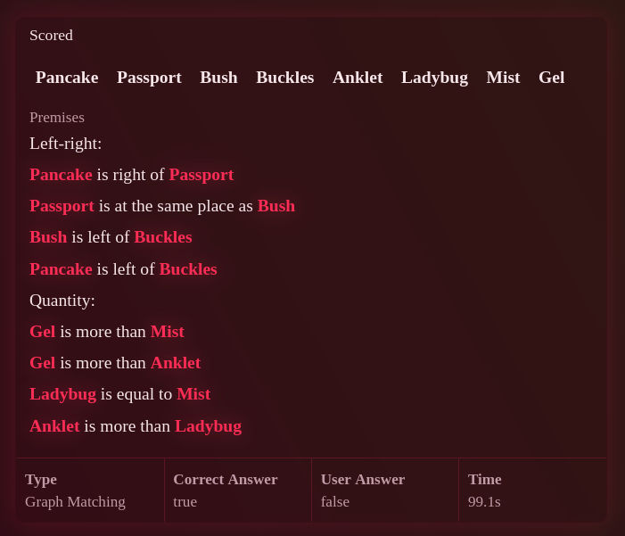
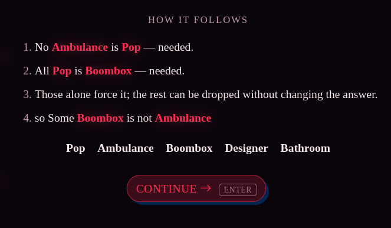

# 3 — Explanations

> Explanation diagrams for many modes don't make sense or aren't good.

The roadmap records that all twenty-five sampled modes explain themselves, and
that is true — `explanation` is populated everywhere. What the source shows is
that *populated* and *explanatory* came apart in several modes: the text is
present, correct, and useless to the person reading it, which is the only
audience it has.

The three instances differ in kind, so they are three fixes, not one. Section
3.4 is the general rule they share.

---

## 3.1 Construct answers scored per dimension — **BUILT**

`compareConstruction` in
[`utils/construct.utils.ts`](../src/app/syllogimous/utils/construct.utils.ts)
returns one row per dimension — label, axis colour, what was entered, what was
right — and History renders it above the verdict cells. Beside `slotSatisfied`
rather than in a component, because the screen and the placement test both have
to say the same thing about the same answer, and a second opinion about what
"correct" means is how a trainer marks a right answer wrong.

Two distinctions it draws that the request did not name, and both matter more
than the row itself:

- **Right way, wrong distance** is reported as its own outcome. It is a slip in
  arithmetic where a wrong direction is a slip in reading, and a screen calling
  both "wrong" cannot say which was made.
- **A circular slot is judged as one claim.** Two steps clockwise round a
  five-loop *is* three anticlockwise, so splitting it into a direction and a
  distance would report a correct answer as half wrong — and `slotSatisfied`
  already accepts it, so the two would have disagreed about the same answer.

**Both remainders are now built.**

**The rows are on the game screen's review panel**, above the map. A player
reviewing a wrong seven-dimension answer needs to know *which* dimension while
the item is still in front of them; finding out days later in History is
finding out about a different item.

**And the stats screen says which dimension you lose** — `dimensionBreakdown`
over the answered history, shown worst first.

Three decisions, each of which would otherwise have made the number mean
something else:

- **Derived from the history, not tallied as answers come in.** The questions
  already carry what was asked and what was entered, and `compareConstruction`
  is the same judge the review rows and the ability model read — so there is no
  third place for the three to disagree, and the report covers history recorded
  before it was written.
- **An unfilled slot is not a mistake.** A timed-out construction leaves every
  slot blank, and counting those would fill the report with dimensions the
  player never reached — which reads as "you are bad at seven axes" when what
  happened was the clock.
- **Reading and counting are reported apart**, which is what
  `SlotComparison.directionOk` was for and had nowhere to go. A wrong direction
  is a slip in reading the premises; a wrong distance having read them right is
  a slip in arithmetic. Different problems, different remedies, and one number
  covering both is the same one-bit summary construction exists to replace, one
  level up.

### The original diagnosis


> can u modify ur construct conclusion explanation type to be similar to
> mitullos? where, it shows ur answer by dimension to the correct one, so u can
> see which dimension u messed up in exactly
>
> — palmzilla A.Azoulay

Today a construct answer collapses to `Correct Answer: true / User Answer:
false`. The wanted display is beside it in the same screenshot:

> **Your answer:** East · Same · Same · Equal
> **Correct:** East · Same · Same · **More**

Three of four dimensions right and one wrong is reported as "false", which
throws away the whole reason construction was built. Its own justification in
[`question.models.ts`](../src/app/syllogimous/models/question.models.ts) is that
*"a placement or a rating built on binary answers cannot tell a lucky run from
an understood one"* — and then the result screen re-collapses it to a binary.

### The fix

Everything needed is already on the `Question`. `construct: ConstructClaim[]`
holds the slots with `label`, `colorClass`, `directions`, `answerDirection` and
`answerMagnitude`; `userConstruct` holds what was entered, in the same shape.
The work is a renderer, not a model change:

- One row per slot, in premise order, labelled with the slot's `label` and
  painted with its `colorClass` so it matches how the premises coloured that
  dimension.
- Two columns: entered, correct. Mark only the slots that differ.
- Where `asksDistance` is set, direction and magnitude are separate marks —
  right direction, wrong distance is a different error from wrong direction, and
  `slotSatisfied` already distinguishes them.
- `modulus`, where present, must be honoured in the comparison and not only in
  the grading: showing "2 clockwise" against "3 anticlockwise" as a mismatch on
  a five-loop would be showing a correct answer as wrong.

This belongs on the result card and in History, which is where the second half
of the screenshot is from.

### Worth doing beyond the request

Once per-slot correctness is recorded rather than only displayed, the stats
screen can report which *dimension* a player loses. That is the most actionable
number the app could show about the composed spaces and it costs one extra field
on the answer record.

---

## 3.2 Graph Matching has no derivation — **BUILT for the reported form**

The screenshot is the **relational** form — two sets of statements in different
vocabularies, "Left-right:" against "Quantity:" — and its derivation asserted
the answer in different words: *"every one of the first set's links can be
matched onto the second's, name for name"*. True, and no help. Someone who
could already see the correspondence did not need the line; someone who could
not was told the conclusion twice.

It now states the pairing and then shows it working, link by link, in both
vocabularies:

```
Pair them off: Drop/Booklet, Bag/Cocktail, Bun/Musician, Stain/Gull, Flat/Sculpture.
Bun is after Stain, so the second set would need Musician is on top of Gull
  — and it does not say that.
No other pairing of the names does better — every one was tried.
```

The pairing is known exactly rather than searched for: the second set is the
first relabelled position for position. On a false item that is still the
closest pairing available — `editDistance` has already established that no
bijection does better — so the link named as disagreeing is a real
disagreement rather than an artefact of having guessed the wrong pairing.

**Still to do:** the two labelled-graph forms below, whose `explainGraph` has
the same shape of problem, and the change to `areGraphsIsomorphic` that the
general fix needs. The relational form did not need it, which is why it went
first.

### The original diagnosis



> I dislike how the conclusion explanation is displayed here, I cannot
> understand why they are the same based on the displayed explanation at the
> top.

The explanation is the premises, re-listed, grouped by dimension. The question
was whether two relational structures match; the explanation restates both
structures and stops. Nothing in it is wrong and nothing in it answers the
question, because the answer to "why are these the same" is *the mapping*, and
the mapping is the one thing not shown.

`explainGraph` at
[`graph-matching.ts:222`](../src/app/syllogimous/generators/graph-matching.ts)
is where this is built, and `areGraphsIsomorphic` in `question.utils.ts` is what
decided the answer.

### The fix

**When the answer is "they match":** show the correspondence and then show it
working.

```
Pancake ↔ Gel        (each is the one nothing points to)
Passport ↔ Anklet
Bush ↔ Mist
Buckles ↔ Ladybug

Pancake is right of Passport   ↔   Gel is more than Anklet
Passport is at the same place as Bush  ↔  Anklet is … 
```

Two columns, one row per relation, so the reader can check the claim rather than
be told it. The pairing has to be the one the isomorphism check actually found —
which means `areGraphsIsomorphic` must **return** its witness rather than a
boolean. That is the substantive part of this fix; the rendering is
straightforward once the mapping is in hand.

**When the answer is "they do not match":** show the single relation that has no
counterpart. A non-isomorphism has a witness too and it is usually small — a
degree that appears in one structure and not the other, or one pair whose
relation is reversed. One line naming it teaches more than four lines of
correspondence, and the search already has to find it to return false.

**Verification.** The witness mapping, applied to the first structure's
relations, must reproduce the second structure's exactly. That is a stronger
check than the existing boolean and it validates `areGraphsIsomorphic` itself as
a side effect.

---

## 3.3 The syllogism derivation reads as a chain



> This is an explanation after a failed puzzle, the order that is displayed
> looks so unfit for a syllogism and you cannot understand anything based on it
> alone.

```
HOW IT FOLLOWS
1. No Ambulance is Pop — needed.
2. All Pop is Boombox — needed.
3. Those alone force it; the rest can be dropped without changing the answer.
4. so Some Boombox is not Ambulance
```

This is also the defect behind [shot 14](shots/14-syllogism-two-negatives.png)
and [1.2](1-correctness.md#12-the-two-negative-premise-syllogism), so the fix
below serves both.

### The diagram is the fix — **BUILT**

`vennFor` in [`utils/venn.utils.ts`](../src/app/syllogimous/utils/venn.utils.ts)
turns the load-bearing premises into shaded regions and existential marks;
`app-venn` draws them beside the derivation on the review screen. It is the
standard Venn test, which is a *decision procedure* rather than an
illustration — the conclusion follows exactly when the picture already shows it.

Three things worth recording:

- **The load-bearing premises, not all of them.** Drawing premises that greedy
  removal showed do not matter would shade regions the answer does not turn on.
- **A mark straddles when the premises do not pin it.** "Some S is M" with
  nothing said about P leaves two places the thing could be, and a dot inside
  either one asserts something the premises never did. This is the whole reason
  to draw rather than describe.
- **It declines rather than guessing.** `rolesFor` returns null unless the
  support resolves to exactly one middle term, and `undrawn` reports any premise
  it could not place. A decision procedure that quietly drops a premise draws a
  picture saying less than the item does, which is the one failure it must not
  have.

Shot 14 is the case this serves best: two negative premises leave the S/P
overlap **open** — neither shaded nor marked — which is "the premises do not
settle this", visibly distinct from "ruled out". That is the same distinction
[1.2](1-correctness.md#12-the-two-negative-premise-syllogism) wants in words.

**All three generators explain themselves, too — and one never did.** Fredo
set no `explanation` at all, and `createSyllogism` picks between it and Canyon
on a coin flip by default, so **half of every player's syllogisms answered a
wrong answer with a verdict and nothing else**. Not intermittently broken:
never present, half the time. The existing coverage test could not see it,
because the mode *did* explain itself on the runs where the coin came up the
other way — a per-mode check cannot catch a per-generator gap.

Its derivation is built from the premises **as rendered**, not re-worded from
the structure: `getSyllogism` picks a form set internally and may state a
premise in its negated rendering, and a derivation that re-worded it plainly
would read as a flat contradiction of the line above it.

**And history now shows derivations.** It never has. The review overlay shows
one once, only after a wrong answer, and only until it is dismissed — the right
rule for something that interrupts, and the wrong rule for the only other place
an item can be looked at. Every stored question already carried its derivation
and its diagram; nothing rendered them. Shown for correct answers as well, since
"why was that right" is a fair question and the item is already open.

**All three generators draw it.** It first went into `buildSetHierarchy` alone
— which is the *rung* — so the two generators that produce the plain mode, and
both reported items, got nothing. Fredo's premises are rendered strings, so
`sylPremisesFromRule` rebuilds the structure from the rule rather than parsing
the markup back; Canyon draws when the load-bearing premises come to a single
syllogism, and skips a longer chain, where a picture of the last link would
explain a step the reader has not been shown how to reach.

That turned up a stale field: Fredo drew a rule for `question.rule` and a
*second* one for the syllogism it built, so the recorded rule described a
different item. Nothing read it closely enough to notice until the diagram
needed to know which term was the middle.

**The three smaller fixes are done too** — see below. Set Hierarchy is the same
code path as the syllogism branch, so it was never a separate job.

### The original diagnosis

**A stacked list of relations is a chain, and a syllogism is not one.** The
layout above is the same one the scale modes use to state *A is above B, B is
above C* — subject, relation, object, one per line, composing downward. Served
that layout, the eye walks the premises expecting each to link onto the last,
because in every other mode on the card it does. What a syllogism actually
states is two facts about class membership sharing a middle term, and no amount
of reordering the sentences makes a list stop looking like a chain.

Syllogisms are the one mode where a **Venn or Euler diagram is not decoration**:
overlap, exclusion and the existential dot are the entire content, and they are
precisely what a sentence list cannot show. Two or three circles, shapes
determined by the quantifier pair, the middle term as the circle both premises
touch, the conclusion's claim marked on the region it is about.

It is a small SVG. The mode has ninety-odd quantifier-pair configurations and
each maps to one of a handful of diagrams, so this is a lookup and a renderer
rather than a geometry problem. It would serve Set Hierarchy too, which has the
same content and the same chain-shaped display.

Where a false item is *not settled* rather than *ruled out* — see
[1.2](1-correctness.md#12-the-two-negative-premise-syllogism) — the diagram is
the natural place to show it: two arrangements consistent with the premises,
disagreeing about the conclusion. That is a picture people understand
immediately and a sentence almost nobody does.

### Three smaller things in the same four lines — **BUILT**

The derivation now reads: the load-bearing premises in syllogistic order, the
middle term named, what each premise does to the picture, the reading, then the
conclusion — with the bookkeeping about droppable premises moved to the end,
where it is a footnote rather than an interruption.

**The inference sentence was wrong before it was right.** The first version was
a mood table, one sentence per pair of quantifiers, and it was quietly wrong in
half the figures: "All X is M" and "All M is X" carry the same quantifiers and
say different things, so a sentence keyed on quantifiers alone described
whichever figure it was written against. It read plausibly, which is the worst
way for an explanation to be wrong. It is read off the diagram now — shading
says empty, a mark says occupied, neither says open — which is correct in every
figure by construction and teaches the method rather than a result.

The original notes follow.

**The premises are in generator order, not syllogistic order.** A syllogism is
read major premise, minor premise, conclusion, and the middle term is what joins
them. Here the middle term is `Pop`, and nothing says so — the reader has to
find it. Sort the two load-bearing premises so the one containing the
conclusion's predicate comes first, and mark the middle term visibly in both.

**Line 3 is bookkeeping in the middle of an argument.** *"Those alone force it;
the rest can be dropped"* is a statement about the greedy-removal search, not
about the syllogism. It is worth saying — it tells the reader the other premises
were noise — but it belongs after the conclusion, or as the dim `setup` line the
card already has a slot for, not between the premises and the `so`.

**Nothing names the inference.** The step from *No A is P* and *All P is B* to
*Some B is not A* is a specific move with a specific reason: everything that is
`Pop` is `Boombox` and nothing that is `Pop` is `Ambulance`, so there is at least
one `Boombox` outside `Ambulance`. One sentence of that is the whole explanation,
and it is the sentence missing.

Note this particular item also relies on existential import for `Pop` — it needs
there to *be* a `Pop` for "Some Boombox" to follow. Whichever convention
`sylEntails` uses, the derivation should state it, because a reader who does not
share the convention will read a correct derivation as a wrong one.

**A diagram would carry this better than prose.** Syllogisms are the one mode
where a two- or three-circle Euler diagram is not decoration: overlap, exclusion
and the existential dot are the entire content. It is a small SVG, the shapes
are determined by the quantifier pair, and it would serve Set Hierarchy too.

---

## 3.4 The rule the three share

An explanation exists to answer *why*, and each of these answers *what*
instead — here are the premises again, here are the premises that mattered, here
is a verdict. The distinction is testable, and the test is not a rendering check:

> A derivation must contain at least one statement that appears in neither the
> premises nor the conclusion.

A derivation made entirely of restated premises has done no work. That is a
crude rule and it would pass some bad derivations, but every one of the three
above fails it, which makes it worth having as a floor in
`tests/derivation.test.ts` alongside the existing coverage test. The coverage
test's floor is already the full set of modes rather than a number to beat;
this adds a floor on what counts as coverage.

---

## 3.5 An off switch for the overlay — **BUILT**

Everything above is about making the explanation worth reading. None of it
answers the reader who does not want to be stopped: the panel interrupts twice a
minute in a bad run, and someone drilling for speed already knows why they were
wrong before the derivation has finished rendering.

**Display & timer → After a wrong answer → Explain wrong answers**, on by
default. Off, a wrong answer flows into the next question the way a correct one
does.

Three things about how it is built are worth stating, because each was a choice
and not the only option:

- **It empties `game.review`, which is what the whole panel is shown by.** So it
  takes the map, the Venn, the stages and the per-dimension breakdown with it,
  not just the prose. Those *are* the explanation in the modes where a picture
  explains better than a sentence — §3.1 and §3.3 both argue exactly that — and
  a switch that left half the panel up would be a switch about paragraphs rather
  than about being interrupted. It is also already the behaviour of every mode
  that derives nothing: no panel, straight on. Off makes every mode behave the
  way those ones always have.

- **Nothing is discarded.** `explanation` is still built and still stored on the
  question, and History still renders it for every item, right or wrong. The
  switch suppresses an interruption, not a record — which is the difference
  between turning off a notification and deleting the mail.

- **Stored as an off switch** (`SYL_EXPLANATIONS_OFF`), like
  `SYL_TRAINING_UNITS_OFF`, so absence means shown and no existing player is
  migrated onto anything. Switching it back on removes the key rather than
  storing a `true`, which keeps the default a thing that can still be changed
  later instead of one frozen into everybody's storage.

The rule lives in
[`utils/review.utils.ts`](../src/app/syllogimous/utils/review.utils.ts) rather
than inline in `showVerdict`, because `GameService` needs a router, a modal
service and four more collaborators to construct, and "does the panel open" is
worth a test rather than a look at the screen — the lesson `tests/display.test.ts`
opens with. `tests/review.test.ts` holds the five cases: the untouched default,
off, back on, that on leaves no key behind, and that a correct answer never
opened it either way.
