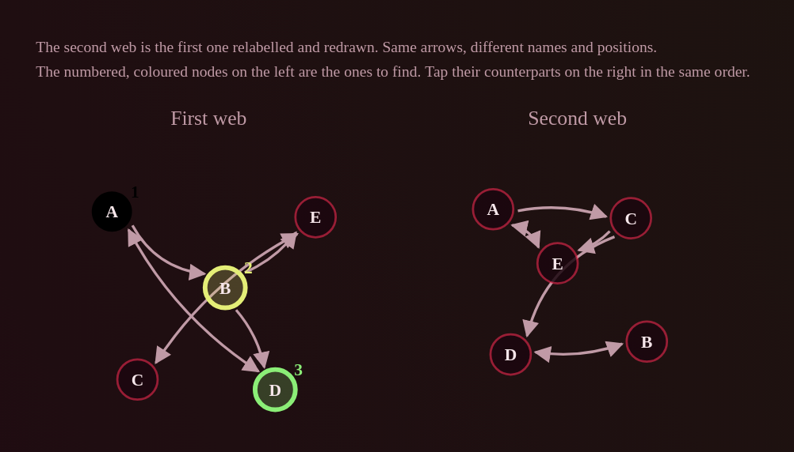

# 4 — Legibility

Four places where the information is correct and cannot be read. The favicon is
in here rather than in a section of its own because it is the same failure: the
right asset exists and the wrong one is what reaches the eye.

---

## 4.1 Relational Web

> The web's arrows can hardly be distinguished. The black of the A is also bad.
>
> A good example of this exercise is here: [shot 07]

| current | the reference |
|---|---|
|  |  |

The black node is a variable-name bug and is fixed in
[1.3](1-correctness.md#13-the-black-node-in-relational-web). The rest is design,
and the reference image is unusually useful because it is the same exercise
solved well — it is worth reading off what it does differently rather than
inventing improvements.

**What the reference does that the current drawing does not:**

- **Arrows are the brightest thing on the canvas.** Bright blue on deep navy.
  The current stroke is `var(--th-text-dim)` at 1.7
  ([`relational-web.component.css:10`](../src/app/syllogimous/components/relational-web/relational-web.component.css)) —
  the *dim* text colour, which is the colour chosen for things that should
  recede. The arrows are the premises here; nothing should be brighter.
- **Arrows are straight.** The current ones bow to avoid overlapping
  neighbours — `layoutArrows` in
  [`web.utils.ts:495`](../src/app/syllogimous/utils/web.utils.ts), and its
  comment explains at length why a fixed bow does not work. It is careful code
  solving the wrong problem: the crossings come from the circular node layout
  (`web.utils.ts:296`, every node on one circle at equal radius), and curving
  the edges is compensation for a layout that puts them in each other's way.
- **Nodes are opaque and light on dark.** The current node is
  `color-mix(--th-panel 85%, transparent)` — a translucent panel colour, so an
  arrow passing behind a node shows through it and reads as passing *into* it.
- **Nodes are labelled by their degree signature**, `out/in`, not by an
  arbitrary letter. This is the largest difference and it is not cosmetic: it
  turns "compare two pictures" into "match the 2/0 to the 2/0", which is what
  makes the reference readable at a glance. It also changes the exercise, so it
  is a choice rather than a fix — see below.
- **A legend states the task**, in the picture, every time.

**Done:**

1. **Arrows in the foreground colour, at 2.2.** They were `--th-text-dim` — the
   colour reserved for what should recede — at 1.7, in a picture whose entire
   content is which way each arrow runs. Heads and self-loops with them.
2. **Opaque nodes.** They were the panel colour at 85%, and the missing 15% was
   enough for a shaft to show through a circle, which in this mode is not a
   cosmetic difference.
3. **`clearestScatter`: the clearest of eighty scatters.** Measured over real
   generated webs, about **18%** of drawn arrows passed under a node that was
   neither of their ends — an arrow that does that reads as ending there. Now
   about **3%**. Zero is not reachable: a dense web on twelve nodes has no
   arrangement in which no arrow passes near any node.

**5. Ports: each arrow gets its own point on the node's rim.** The reported
picture still had arrows arriving bundled, and bowing structurally cannot fix
that — a bow bends the *middle* of a curve and leaves both ends exactly where
they were, so a fan of arrows converging on one node stayed a fan converging on
one point however hard it was bent. `layoutArrows` even made it worse by
excusing the crowding from measurement: for edges sharing a node it skipped
eight of twenty-five samples at each end, on the reasoning that they must meet
there anyway — so the one region where the crowding showed was the one region
no candidate was scored on.

They must meet at the node. They need not *approach* along the same line.
`portsFor` gives every incident arrow its own bearing on the rim, at least 45°
from its neighbours. Same-node pairs passing within six units of each other:
**17.7% → 3.3%**, median clearance 13.9 → 23.3. 45° was measured against 60°,
72° and 90°, and is also the one that leaves an arrow pointing nearest to where
it is going.

**The first version of the spread handed the answer over, and the test caught
it.** Walking the sorted bearings and pushing each one to at least the minimum
past the last separates them perfectly well — and turns a crowded node into a
comb of exact minimums whose shape depends only on *how many arrows the node
has*. Isomorphic webs have equal degree at matched nodes, so they grew
identical fans: 28% of matched nodes were drawn the same, and a reader could
have paired them off without following a single arrow. In a mode whose entire
question is whether two webs are the same shape, that is not a legibility bug,
it is the answer printed on the page.

The slack is now shared out **in proportion to the natural gaps**: each gap gets
the minimum plus its share of what the circle has left over. It fits exactly,
clears the minimum everywhere, and leaves a lopsided node looking lopsided —
which is scatter, not structure. The ordering is therefore driven by the
drawing and never by the graph, which is the property the mode rests on and now
has a test of its own.

**6. The obstruction measure was measuring the wrong path — FIXED.** Arrows
were still crossing nodes after the ports went in, and the reason was that
nothing had ever measured the arrows that are drawn. `obstructions` took the
**straight segment between two centres**, and an arrow has not been straight for
a long time: it bows, and since ports it also leaves and arrives somewhere other
than that line. So `clearestScatter` was choosing among eighty layouts on a path
nobody draws. The reported figure was about 3%; the arrows actually drawn passed
under an unrelated node **10.6%** of the time.

Two changes, and the measured effect is 10.6% → **2.9%**:

- **`obstructions` samples the drawn curve**, built through the same ports and
  bow the drawing uses. `edgeList` and the path builder are shared with the
  renderer so the two cannot come apart again — keeping a second copy of the
  rule is exactly how they came apart the first time.
- **The curvature search avoids nodes as well as other arrows.** It scored a
  candidate purely on how near it passed to its *neighbours*, so an arrow with
  no near-parallel rival took the first curvature offered however squarely it
  crossed a node. Both are scored now and the worse of the two decides, since a
  drawing is only as clear as its worst crossing.

**A measure that does not measure the thing shipped is worse than none**: it
reports success while the fault is on screen, which is precisely what happened
here across two rounds of work on this mode. The test now asserts the property
of the paths `layoutArrows` returns, and counts once per drawn arrow rather than
once per adjacency — a mutual pair is one path with a head at each end, and
counting it twice was quietly halving the rate as well.

**Item 3 of the original plan was wrong, and is not done.** It said to replace
the scatter with a layered layout, sources at the top and sinks at the bottom.
`scatterLayout`'s own comment explains why that undercuts the mode: a ring made
a rotational symmetry visible *as a turn of the picture*, and a force-directed
layout settles into regular arrangements — both hand over structure the mode
exists to make you derive from the arrows. A layered layout does it worse than
either, since ranking the nodes by depth is most of the answer drawn on the
page. The bowing stays for the same reason it was written: it separates
near-parallel edges leaving one node, which is a different problem from
crossings and is already solved.

`clearestScatter` respects that reasoning rather than working around it. The
scatters are still structure-blind and still random; it only chooses among
them, on a measure about *arrows and nodes* rather than about structure, so
every arrangement it can produce is one the sampler could have produced first
time.

4. **Degree labels stay a rung, unbuilt.** The reference's `out/in` labelling
   makes the exercise easier by design, and the roadmap already treats "no
   counting arrows" as a rung (`structural`), so they belong at the bottom of
   that ladder rather than replacing the letters.

**Verification.** Appearance is checked by eye, but two of the causes are not
appearance and are now tested: no two nodes drawn closer than the node diameter,
and the obstructed-arrow rate, with the bar set at 6% so a regression shows
rather than at wherever the number happens to sit today.

---

## 4.2 The composed-space explanation diagram — **BUILT**

**It was never only the 6-D one.** The author's read is right: the grid draws
the fourth axis and beyond as *slices* — one small picture per combination of
the remaining axes — so it is a Cartesian product and it fails from four axes
up. Four is a row of stacked-plane scenes, five is sixteen of them, six is the
screenshot. Fixing the label collisions would have produced a legible version of
a picture that should not be drawn.

Above three axes `buildQuestionMap` now returns a **table** instead: one row per
object, one column per axis, coordinates relative to the object the frame is
pinned to, columns painted with the same per-axis colours the premises use.
`slices` is empty when `table` is set — a screen showing a table *and* thirty
unreadable grids has replaced nothing.

**Three and under keep the grid**, because three is where the axes can still be
seen: two as a grid and the third as stacked planes, which is v3's drawing and
works.

The frame is named and comes first. Coordinates are relative because that is all
the premises determine — they chain offsets, so the arrangement is fixed only up
to where the chain is pinned, which is what Transformation's derivation already
says and records why it is safe.

**Still to do:** marking the axis the conclusion asks about, which the sketch
below has and the built version does not.

### The original diagnosis


> This is an explanation for 6D I think, yeah you can barely distinguish
> anything.

At six dimensions the diagram renders as a vertical stack of small 2-D grids,
one per combination of the remaining four axes, each captioned
`Time -1 · Containment 1 · Quantity 0 · Distinction 1`. The axis label "Up-down"
is drawn four times per panel, overlapping itself. The object names are the same
colour as the grid lines. There are thirty-odd panels.

The approach does not fail at 6-D because of a rendering bug. It fails because
**small multiples over four free axes is sixteen panels minimum and grows by a
factor of two or three per axis**, and the reader has to find the one panel that
matters before reading anything. Fixing the label collisions would produce a
legible version of a diagram that should not be drawn.

**What to draw instead.** Above three axes, the honest picture is a table, not a
space:

```
             E-W    N-S    U-D    Time   Size   Amount
  Cup         -2     +1      0      -1     +1      0
  Chalk        0      0      0       0      0      0     ← origin
  Needle       0      0     -1      -1     +2      0
  Museum      +1     -1     -1       0     +2     +1
                                    ▲
                    the axis the conclusion is about
```

One row per object, one column per axis, coordinates relative to whichever
object the premises pin the frame to — Transformation's derivation already
states coordinates relative to the first object for exactly this reason, and
records why it is safe to do so. Columns painted with the same per-axis colours
the premises use, so the table and the sentences agree. The axis the conclusion
asks about is marked.

This is readable at any dimensionality, which the grid is not, and it is what a
person reconstructs on paper when they get one of these wrong.
`wordCoordMap` and `axisNames` are already on the `Question` and hold precisely
this data — the comment on `wordCoordMap` says it is kept *"so the item can be
drawn afterwards"*.

**Keep the grid for two and three axes**, where it is genuinely better than a
table and where it currently works. The switch is on axis count.

**Fix the label repetition regardless.** Whatever is drawing "Up-down" once per
grid row rather than once per grid is a bug in its own right and will show up in
the 3-D case too.

---

## 4.2b One stimulus in four rendered as nothing — **FIXED**

Reported as *"there appear to be symbols the program cant display"*, on an
Analogy item with a hole where a subject should be — twice, once in a premise
and once in the conclusion.

Not a font gap on one machine. `getEmojis` built its pool by walking whole
Unicode **blocks**, and a block is a range of addresses rather than a list of
emoji. **209 of 848 entries drew nothing**, so roughly one stimulus in four was
invisible.

Two kinds were getting through. **Unassigned code points**, which no font has a
glyph for. And **text-presentation emoji** like U+1F321, which are assigned but
render as an emoji only when followed by U+FE0F — and nothing here appends a
variation selector.

`\p{Emoji_Presentation}` is exactly the property that separates them: true for
the code points that draw as an emoji unaided, which is the only kind this pool
can use. Read from the platform's Unicode data rather than curated by hand, so
the pool follows the standard instead of drifting behind a list.

This is worse than a merely ugly stimulus, which is why it is here rather than
in the correctness section by charity: the premise still reads as a *sentence*,
with a gap in it, and the reader cannot tell whether the gap is the thing they
are meant to be tracking or a word they failed to see.

---

## 4.2c The rule you must hold scrolled off the card — **FIXED**

Reported of the stimulus-function mode: *"you cant see how linear maps to the
adjective, in fullscreen for example height to fragility isnt specified"*.

The item states two things at the top — which object has the property, and
**which direction along the scale carries more of it** — and then a list of
premises, a question and a column of options. Once the premises are long enough
the top scrolls away, and in fullscreen the rule is simply not on screen when
the options are. The whole item turns on it.

It is repeated in the prompt, which sits with the options: *"Which is least
dangerous? — greater means more dangerous"*. A fact you must hold and cannot see
is not a difficulty, it is a defect, and the cheapest repair is to put it where
the answering happens rather than to hope the card is short.

The setup lines stay as they are. Making the whole setup **stick** to the top of
the scrolling card would fix this for every mode at once and is the better
answer if it works; it is a layout change nobody has looked at yet, so it is
noted here rather than shipped blind.

---

## 4.2d The extreme question offered eight options — **FIXED**

Same screenshot, and the same reason it was worth reporting: *"reduce options to
the 2 most closest"*.

*"Which is least fragile?"* listed every object. That is a **scan**: eight names,
one of which is at the end of the line, and the seven plainly not at the end
cost nothing to dismiss. The question is really between the extreme and whatever
sits next to it, so that is what it now asks.

The guess floor is worse on paper — one in two against one in eight — and the
item is harder in fact, because there is nothing left to eliminate without
working the order out. Which is the trade this whole plan keeps making: a
smaller menu you have to *earn* beats a longer one you can shorten by looking.

---

## 4.3 Negation is the least legible thing on the card

Not in the source list — an observation from reading the stylesheet, visible in
[shot 14](shots/14-syllogism-two-negatives.png) and
[shot 13](shots/13-unreferenced-object.png). It is *not* what those screenshots
were reported for; that is
[3.3](3-explanations.md#33-the-syllogism-derivation-reads-as-a-chain).

```css
/* card.component.scss:27 */
.is-negated { color: var(--negated-color); font-style: italic; }
```

```css
/* styles.css:5 */
--negated-color: rgb(128, 0, 0);
```

Dark maroon, italic. On the dark red-black panel these themes use, the `No` in
*"**No** Swimmer is Fisherman"* and the `is not` in *"Some Zipper **is not**
Swimmer"* are the dimmest glyphs in the sentence — and they are the glyphs that
invert its meaning. Every other word is bright.

The cause is that `--negated-color` is the one premise colour that never went
through ThemeService. Everything else is resolved per theme against the measured
panel luminance
([`theme.service.ts:337`](../src/app/syllogimous/services/theme.service.ts));
this is a hard-coded constant in `styles.css` that happens to work on a light
background.

**Fix.** Move it into the theme's resolved variables with the others, derived
from the panel luminance like the dimension palette is. Keep the italic — the
shape cue is good and works independently of colour — and make the colour
prominent rather than recessive. A reversal cue is not a footnote.

This is also worth a check in `tests/display.test.ts`, which already exercises
theme resolution: every colour the card assigns to premise text must clear a
contrast ratio against the resolved panel colour.

---

## 4.4 The icon

> Another issue is that the website icon sometimes resembles the old SYL instead
> of the new triangle.

Confirmed, and it is not intermittent — it is which icon the browser happens to
pick.

`src/assets/favicon.svg` was updated to the new triangle. Every other icon in
`src/` is the old **SYL** wordmark, untouched since the initial import:

```
src/favicon.ico              src/favicon-16x16.png     src/favicon-32x32.png
src/apple-touch-icon.png     src/android-chrome-192x192.png
src/android-chrome-512x512.png
```

All six are declared in `src/index.html:38-44` alongside the SVG. Which one is
used depends on the browser, the surface (tab, bookmark, home screen, PWA
install), and the cache — hence "sometimes".

**Fix.** Regenerate all six from `assets/favicon.svg` at their declared sizes.
Nothing else changes: `index.html` and `angular.json`'s asset list are already
correct and complete.

**Then check `docs/`.** The published build carries its own copies
(`docs/favicon.ico`, `docs/android-chrome-*.png`, …) which are the ones actually
served from Pages, and a rebuild is what replaces them. A stale icon in `docs/`
would keep the old mark live regardless of what `src/` holds.

---

## 4.x Stimuli that never reached the screen — **FIXED**

Found while adding the pharmacy stimulus pool, and it explains an earlier
report of *"symbols the program can't display"* better than the emoji fix did.

Everything on a card reaches the DOM through an `[innerHTML]` binding, and
Angular's sanitiser keeps only the elements on its allowlist. `svg` is not on
it — `VALID_ELEMENTS` in `@angular/core` is void plus block plus inline HTML
elements and nothing else. So a stimulus built out of inline SVG is not styled
oddly; it is **removed**, and the player sees an empty subject where a token
should be.

`visual-noise.utils` had met this, solved it by drawing to a PNG data URL, and
written the reason down — inside that file. `junk-emoji.utils` was written
afterwards and shipped `<svg class="junk">`, so **every junk-shape stimulus was
invisible**. The theme even carried an `svg.junk` rule sizing something that
never arrived, which is what a rule written from the code rather than from the
screen looks like.

### Three changes, and only one of them is the fix

1. **`utils/raster.utils.ts`** — one `rasterise(w, h, scale, draw)` that both
   picture kinds go through, carrying the explanation. A rule that has to be
   rediscovered belongs where both callers already are.
2. **Junk shapes draw to a canvas** and ship as ``.
   Their six silhouettes are now described once as geometry and rendered twice
   — SVG for the no-canvas fallback, canvas for the screen — because two
   hand-written copies of six shapes drift.
3. **The guard was wrong in both files.** `typeof document === "undefined"` asks
   whether there is a document, not whether there is anything to draw with. The
   test harness stubs a `document` with a `documentElement` and no
   `createElement`, so under test both would have thrown; in a browser with a
   partial DOM they would too. `rasterise` returns `null` when it cannot draw
   and the callers fall back.

**Test.** `tests/stimuli.test.ts` holds every pool — letters, nouns, emoji, junk
shapes, visual noise, pharmacy — to markup the sanitiser keeps, and asserts that
a picture stimulus *ships* as an image. That last part matters: the SVG output
is a legitimate fallback for having no canvas, so a test that read the fallback
would be checking the one path that never reaches a player, which is how this
survived being written down.

---

## 4.y The grids were rebuilt on every change-detection pass — **FIXED**

> The website often slows down or completely breaks especially with the axis
> mode.

Not the generators. Every mode builds an item in under 8ms and Axis Maps in
under 2ms, measured across 40 draws each at five premise counts. The cost was in
the drawing, and it was paid over and over.

`app-question-map` takes a `plot` input, and **all five callers pass an object
literal**:

```html
<app-question-map [plot]="{ map: g.map, axes: game.question.gridAxes, … }">
```

Angular compares inputs by reference, so a fresh literal every change-detection
pass reads as a changed input — and the setter rebuilds the whole grid through
`buildQuestionMap`. Four of the five are on the game screen and one of those is
inside an `*ngFor` over the options, so the work is *grids × options*, redone on
every tick of the clock, every keypress and every mouse move.

Axis Maps is the worst case and that is not a coincidence: it is the mode that
draws a grid per option on top of the ones in its premises.

`StagesComponent` had the same fault twice over — its `bounds` was a *getter*
returning a fresh array, so even a stable literal would have looked new.

**Fix.** The setter compares the three fields by reference and returns early
when nothing moved; they are stable references off the question, so it is O(1)
and can only ever rebuild more often than needed, never less. Fixed there rather
than in five templates, which also covers the sixth one somebody writes later.
`bounds` and the plot object became fields recomputed when the step changes.

**Also removed: an unbounded loop that could freeze the tab.**
`getRandomSymbols` drew random indices and rejected the ones already seen, with
no exit when more stimuli were asked for than the pool holds. Nothing asks for
that many today — but the pool size depends on which stimulus kinds are on and
their weights in the mix, so "today" was a property of the settings rather than
of the code. It is capped now, and a short pool repeats rather than hanging: a
duplicate stimulus is a thing you can see and report, and a frozen page is not.

---

## 4.z Zen mode — **BUILT**

> Make a zen mode without true false buttons and no explanations where all can
> be controlled with arrow keys. The options should also be controlled with the
> arrow keys.

**Display & timer → Zen mode.** One switch, because it is one way of playing
rather than three settings that happen to combine.

- **No answer buttons.** They swapped sides between questions on purpose, which
  already made the mouse the slow way to play them — you cannot aim before you
  have read. Removing them takes the last thing off the card that is not the
  question.
- **No explanation.** It *overrides* the "Explain wrong answers" switch rather
  than writing to it, so turning zen off gives back whatever was set before
  rather than whatever zen left behind. That is the part with a test.
- **The options on the arrows.** Up and down move a cursor through them and
  `submit` — Space by default — answers.

### Two decisions inside that

**Up and down move the cursor, not left and right.** Left and right already page
the carousel, and an item can be a carousel *and* a picking item, so the two
would fight over the same keys on exactly the items where both matter. Up and
down are free on a picking item, since there is no true or false to press.

**The cursor starts nowhere.** `choiceFocus` is −1 until the first arrow press,
so an item does not open with an answer already half-given — a highlight that is
there before you touch anything reads as a suggestion. It wraps once it exists,
because a cursor that stops at the end makes you count to know which way is
shorter, and not having to look is the point.

Number keys still answer directly, and now work on the grid-option items too —
they were bounded by `choices.length`, which is empty when the options are
drawings. The carousel arrows are untouched.

**One line of key hints stays**, muted, under the card. Zen mode is about having
less to look at, not about guessing: a screen with no controls and no hint is a
screen you cannot start.
