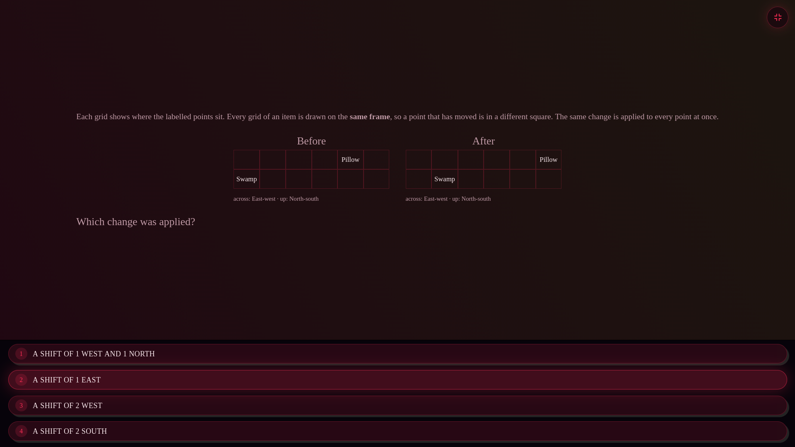

# 5 — Mode reworks

Two modes the author asks to have rebuilt rather than adjusted. Both are larger
and less determined than anything else in this plan, and Oddest Relation needs a
decision before code.

Do these last. Both are self-contained — nothing in sections 1–4 depends on
them — and both will be easier once `derivationDepth` from
[section 2](2-conclusion-depth.md) exists, because the difficulty of the
replacements is exactly the thing that is hard to judge by eye.

---

## 5.1 Transformation Matching — **SUPERSEDED**, see P13

> I did not like the grid structure in general. I would rather replace the whole
> thing with P13, or make it a variant of P13 — but never a grid, and always
> with Anchor Space anchors as permanent coordinate anchors. Besides, this way
> it can be more than 2-dimensional.

Settled: this mode is not repaired, it is **replaced** by
[P13, Axis maps](../roadmap/open.md#p13-axis-maps--proposed-not-built-replaces-transformation-matching).
Same question — two descriptions of the same objects, induce what maps one to
the other — stated relationally against a fixed anchor frame instead of drawn as
two grids.

Three reasons the grid had to go, and only the first is about looks: a grid is
two-dimensional and the mode has no reason to be; reading two pictures side by
side is a visual diff where reading two descriptions is an inference; and a grid
cannot state a shift without restating everything.

Recording it also fixed a mistake in P13's first draft, which had the map
applying to the anchors as well and therefore pinning two of six axes. The map
acts on objects' *displacements* and the anchors are the frame those are
measured in — so nothing is pinned, every axis is free, and offsets become
detectable, since a shift is invisible between objects and obvious against a
frame that does not move.

**Interim.** Transformation Matching keeps working until P13 replaces it, and
one fault worth fixing meanwhile has been: its distractors only had to *differ*
from the truth, which admits an option wrong on every point — eliminated by
checking any one of them, so three such options let the whole item fall to a
single glance. They must now be near misses, agreeing with the truth somewhere,
and the option set is chosen to minimise how many points decide the item alone.
That is the actual reason the screenshot was obvious; the generator's
transformation pool already held rotations, reflections and scalings, which the
original diagnosis below assumed it lacked.

### The original diagnosis, kept for the parts that carried over



> I really dislike this type of puzzle even just the display and it's so
> obvious, I think this is transformation matching or something but it needs to
> be reworked completely.

[`generators/transform-match.ts`](../src/app/syllogimous/generators/transform-match.ts),
485 lines, drawn by the `grids` renderer.

### What is wrong with it

**Two points on a 6×2 grid is not a puzzle.** `Pillow` does not move; `Swamp`
moves one square east. Reading the answer takes one saccade. The mode's own
justification — *"you cannot see a rotation in a column of numbers, which is
precisely the thing the mode asks you to spot"* — is sound, and undermined by
giving the eye two points and one row of freedom.

**The distractors give it away.** *1 west and 1 north*, *1 east*, *2 west*,
*2 south*. Only one option is a single-axis eastward move, and only one is
consistent with `Pillow` staying inside the frame. Both filters are applied
before looking at the grids at all.

**The layout wastes the screen.** Two small grids in the middle of a 1920×1080
canvas, roughly 800 vertical pixels empty, options pinned to the bottom edge far
from the thing they describe. Whatever else changes, this should not survive.

### The rework

**More points, and enough of them that the transformation must be inferred
rather than seen.** Five or six, on a grid tall enough to have two free axes.
With two points, one correspondence is forced; with six, the reader has to find
which arrangement is preserved.

**Transformations beyond translation.** Rotation, reflection and glide are the
interesting cases and are precisely the ones a coordinate list hides. A
translation-only mode is a subtraction problem drawn as a picture. The
`transformations.utils.ts` library already implements rotations and reflections
for the composed spaces — this is composition, not new geometry.

**Distractors that are near-misses.** Each wrong option should agree with the
correct one on some of the points, so eliminating it requires checking a point
rather than checking the frame. A wrong option that no point supports is not a
distractor. Concretely: generate candidates by perturbing the true
transformation, then reject any candidate that can be ruled out from fewer than
two points.

**Options as grids, not as sentences.** `choiceGrids` already exists on
`Question` and is documented as *"options that are themselves arrangements,
drawn on the same frame"* — the mode has the capability and this item did not
use it. Naming the transformation in words invites solving the words.

**Fill the frame.** Grids centred and sized to the available height, options
beside or beneath them at the same scale.

### Verification

Two properties, both of which this item fails:

- **No option is eliminable without reading the grids.** Formally: for each
  wrong option, at least one point's before-position is consistent with it.
- **No single point determines the answer.** For every point, at least two
  options move it identically.

---

## 5.2 Oddest Relation — **BUILT**, as Widest Group

`generators/widest-group.ts`. The reading the author confirmed, built as a new
mode rather than a rewrite: the old generator keeps working and keeps its
ability history.

**Widest Group is a two-group comparison by default**, also on the author's
call. More groups is not a harder version of the same reading so much as a
longer one — the reading is identical and there is more of it — so it is not
something to hand out for playing well. `groups-3` and `groups-4` are now
**off-ladder**: priced, read by the generator, settable in the per-mode rows in
Customise, and reachable by progression never. Their ladder slots are
tombstones, since rungs are read by position out of a stored count.

`OFF_LADDER_RUNGS` is the general form, and it is worth having as a category:
a ladder is a promise that playing well brings a thing about, and some things
change what a mode *is* rather than how hard it is.

**`rank` went with them, because it cannot exist without more groups.** Two
groups have two possible orderings, so a ranked item cannot put three wrong
ones beside the right one — the generator spends its whole attempt budget
hunting distractors and throws. That had been invisible: `groups-3` sat before
`rank` on the ladder, so the dependency was always satisfied by accident.
Taking the groups off broke every ranked item immediately, which is how it was
found. `rank` now forces three groups on its own, so switching it on alone
produces a working item rather than a failure.

**Oddest Relation is now off by default**, on the author's call, the same
retirement Transformation Matching got in [5.1](#51-transformation-matching):
`enabled: false` in the settings params and zeroed in every row of
`TIERS_MATRIX`. Kept rather than deleted — the ability history is real, and a
player who liked it can switch it back on in Customise.

**Retirement is two edits, and doing one is worse than doing neither.** Turning
it off in the params alone leaves a fresh install without it and every existing
account with it, because the tier matrix is what each tier offers — twenty rows
still had it. `tsc` cannot see this: the matrix is a positional tuple and only
its width is checked. The test now asserts both halves for both retired modes.

**Stated as spatial premises against one marker**, the way every other spatial
mode states things:

```
Everything is placed against ★, which never moves.
Group 3
  Cottage is 1 north, 4 above relative to ★
  Choker is 2 west, 1 north, 3 below relative to ★
  Bubble is 1 west, 1 north, 1 below relative to ★
  Silver is 2 east, 2 above relative to ★
```

It was a table of coordinates first, on the reasoning that thirty numbers read
better in columns. That is true and beside the point: a table is easier to
*scan*, and reading "3 east, 1 above relative to ★" and holding it is part of
the work — a mode that hands the same facts over as a column of integers has
removed that part without saying so. Zero components are left out, so a member
differing on two directions of six reads as two facts rather than six, which is
what keeps a wide space wide without making every line name every direction.

One marker for the whole item rather than one per group: groups stated against
different markers would put the same arrangement at different numbers, and the
reader would be comparing frames rather than spreads. It changes no answer,
spreads being differences within a group, and that is the point — the frame
gives the numbers a meaning without becoming part of the question. It is never a
member either: a marker among them would enter its group's minimum and maximum,
and a frame that is also a participant is not a frame.

**Built backwards from the answer.** Placing members at random and measuring
afterwards gives no control over the margin between groups, and the margin is
the difficulty: left to chance the winner is usually obvious and occasionally
tied, and tied is worse than obvious. Scores are drawn first — winner, then
runner-up a stated margin below, then the rest below that so no third group can
be mistaken for the answer.

**And then measured back off the finished coordinates.** Placing the two edges
and scattering the rest between them *should* give the spread that was asked
for, and "should" is not a thing to ship: an item whose stated answer disagrees
with its own numbers is the one failure a trainer must not have. The test goes
further and re-derives every spread from the rendered HTML, which is a second
implementation of the whole question.

**Two things had to be unique, not one.** The winner, obviously. But also each
group's *own* widest direction — otherwise "which direction is this group widest
on" has two answers and a reader who checks the other is right and marked wrong.

The ladder opens directions two to six, groups two to four, the margin from two
to one, and finally `rank`: order every group rather than naming the top. Naming
the top needs only the top group's score; ordering needs all of them, so a
reader who spots the winner early cannot stop there.

### The original diagnosis


> I don't like the oddest out how it's currently done, it should be groups and
> you identify the group that has the dimension with the highest difference
> between members at the edges of it.

[`generators/oddest-relation.ts`](../src/app/syllogimous/generators/oddest-relation.ts),
333 lines.

### What it does now

Four relations, each stating six axes. On each axis independently, whichever
direction the majority of relations use is "the pattern"; distance is the count
of axes on which a relation departs from it; the answer is the relation with the
largest count. The rule is stated in the setup line — *"On each dimension,
**most** of these point the same way"* — so nothing has to be inferred, only
counted.

It is arithmetic with reading attached. Six axes × four relations is
twenty-four comparisons, done in a fixed order, with no point at which a
decision is made. Difficulty scales with axis count and never with structure,
which is the thing the roadmap's own ground rule warns against: *difficulty is
structure, not length.*

### What the author is asking for

The sentence describes a different exercise, and the reading that makes it
coherent is:

- The items are partitioned into **groups**.
- Within a group, on each dimension, the members can be laid out along that
  dimension; the group's **spread on that dimension** is the difference between
  its extreme members — its edges.
- Each group's score is its widest dimension.
- The answer is the group with the largest such spread.

That is a genuinely different task from the current one. It requires ordering
members within a group, finding each group's extremes per dimension, and
comparing across groups — three nested steps with real decisions, where the
current mode has one flat count. And it does not decompose into
independent-per-axis arithmetic, because the *widest* dimension has to be found
before groups can be compared.

**Confirmed by the author.** This reading — per-dimension spread between a
group's edge members, the group scored by its widest dimension — is the one to
build. The alternative reading, the group containing the single widest-spread
*pair* regardless of dimension, is not it.

### If the reading holds

**Build it as a new mode, not as a rewrite.** The existing generator keeps
working, keeps its ability history, and the new one enters through the
five-registry checklist in [ROADMAP.md](../ROADMAP.md). The author dislikes the
current mode, which is a reason to stop serving it by default — a settings
change — not a reason to delete an ability estimate that took a hundred answers
to build.

**Present the groups, not sentences.** A group of five items differing on six
dimensions is a table; six clauses per line per member is the display problem
from [4.2](4-legibility.md#42-the-composed-space-explanation-diagram) again,
one mode over.

**Existing pieces that carry over.** `buckets` on `Question` already holds group
membership and is documented for exactly this. The per-axis spread measurement
already exists in the Customise spread control
([`mode-modifiers.component.ts`](../src/app/syllogimous/components/mode-modifiers/mode-modifiers.component.ts)),
which is scoped per axis for the same reason this mode needs it — *"spread is
not one quantity: a long time axis is a different demand from a tall vertical
one"*.

**The generator must control the margin.** The gap between the widest group and
the runner-up is the item's difficulty, and left to chance it will usually be
large enough to see. Draw the intended margin first and search for a
configuration with it — the same inversion the hierarchy generator uses to keep
its answer distribution honest.

### Verification

- The intended answer is the unique maximum. Ties are unanswerable and must be
  rejected at generation, not broken arbitrarily.
- Over 150 items, the margin distribution matches what was asked for, rather
  than whatever a uniform draw produces.
- A solver reading only the rendered table re-derives the answer. Standard for
  this codebase and non-negotiable for a new mode.

---

## 5.x Shape and Rotation: objects that move on their own — **BUILT**

> Add that objects can rotate alone in the shape in the mode, currently only the
> whole shape is spinning.

True, and the setup line said so outright: *"Objects turn with the shape"* was
the whole movement model. Every object's answer was one shared addition applied
to a different starting corner, so once you had the net turn you had all of
them.

**`solo-turns`**, the mode's first rung — its ladder was `[]` — so it is earned,
priced (1.2, above a plain extra turn) and settable in Customise like any other.
A solo step is the one offset that is *not* shared and so cannot be folded into
the running total: the reader carries the shape's turn for everything and a
second number for one object.

Never all of them, and never below three objects. If every object stepped by its
own amount the shape's turn would be dead weight, and the invariance form would
have no pair left to be invariant about.

### The hazard is the other question form, not the feature

This mode's second form asks whether a pair is unchanged by the turns, and its
derivation states outright:

> A turn moves every object by the same amount, so it cannot change how two of
> them sit relative to each other.

**A solo step falsifies exactly that sentence.** Asked about a pair where one
stepped alone, the item would be a confident, correct-looking derivation of a
false claim — and it would read identically to the times it is right, which is
the one failure here a player could not catch.

So the invariance form now requires the pair to have moved the *same* amount on
their own, which for most pairs means neither did. The pair still has to be
**checked** for solo steps, so the rung adds work to that form rather than
removing it, and the derivation says which case it is in.

**Tests.** `tests/shape-rotation.test.ts`: nothing moves alone without the rung;
with it, over half of items carry a solo step and never all objects at once; the
derivation of a solo answer states the extra step instead of folding it into the
turn; and — the one that matters — no invariance item is ever asked about a pair
that moved differently. Removing the guard fails that last test with the item it
would have served: *"after the turns, Man is 1 corner clockwise from Cashier"*,
asked about a pair one of which had stepped an extra corner anticlockwise.

---

## 5.y Widest Group: not every member against the marker — **BUILT**

> Made widest group so that not all elements have a direct relation to the
> center; the way it is currently done it's a counting task without any
> relational integration.

Accurate, and the premise-building line said it in one expression: every member
was `statePosition(m.name, anchor, m.coord, scales)`. So a group's spread on a
direction was a column of finished numbers to scan for a maximum and a minimum.
Nothing had to be *composed* before it could be compared.

That is a real gap against what the mode's own header claims for it — "the
per-dimension work cannot be finished before the cross-group work starts" was
true of the comparison between groups and false of everything below it.

**At least one member per group is now stated against another member of that
group.** It has to be resolved before it can be ranked, and the ranking is what
the mode is about. Chains are capped at two hops from the marker: past that the
item stops being about spread and becomes an offset chain, which the composed
spaces already are. Within a group only — a member placed against something in
another group would make the groups an arbitrary label on one arrangement, when
the whole question is which of them is widest.

`statePosition` already took an arbitrary reference; the generator had simply
never passed anything but the marker.

### The tests failed, which is what they were for

Three existing tests broke on this and were right to. `tests/widest-group.test.ts`
carries a **solver** that reads the rendered premises the way a player does and
recomputes the answer — and it was reading every line as an absolute position,
so a chained member came out at its displacement rather than its place. It
reported the wrong winner, a group tied with itself, and the wrong margin.

Teaching the solver to resolve chains is what turns this from an assertion into
a verification: it now takes each line's first subject as the object and its
last as the reference, resolves a reference naming an already-placed member, and
agrees with the generator on the winner, the uniqueness of each group's widest,
and the margin. A solver that had kept the old assumption would have agreed with
the generator by sharing its mistake.

Two new tests: every group states at least one member against another member
(the property, rather than the likelihood), and every chained member is placed
against one that has already been placed — a chain nobody can resolve is a group
with no readable spread.

**The marker test was also right to fail** and its intent survives: it defends
"one marker for the whole item, not one per group", so it now ignores
member-relative lines rather than counting them as markers.

The setup line no longer says everything is placed against the marker, because
it is not. And the derivation names the two edge members and says their spread
is read "once every position is resolved against the marker" — with chains in
the premises, a reader who got the item wrong most likely resolved one member to
the wrong place, and a derivation opening with the finished spread explains the
half they already had.
